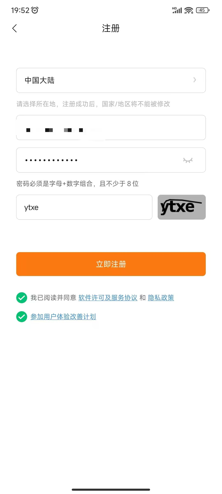
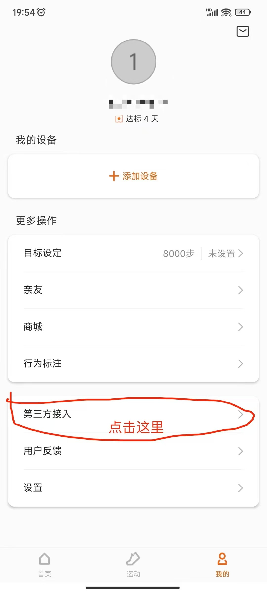

# 使用说明

## 下载 `Zepp life` App


## 用手机号或者邮箱号注册账号




## 绑定 `Zepp life` 账号到微信运动




## 定时任务

[定时任务使用说明](cron.md)

## 本地运行

### 下载程序

https://github.com/k8scat/wechat-steps/releases/latest

### 执行程序

```./wechat-steps -zepp-account=账号 -zepp-password=密码 -steps=步数```

## 注意

- 可多次使用，每次设置的步数只能比上次更多，更少则默认无效。
- 使用频率不要太高，建议每天使用1次。
- 如成功无法刷步数，建议重新注册一个新账号并重新绑定。
